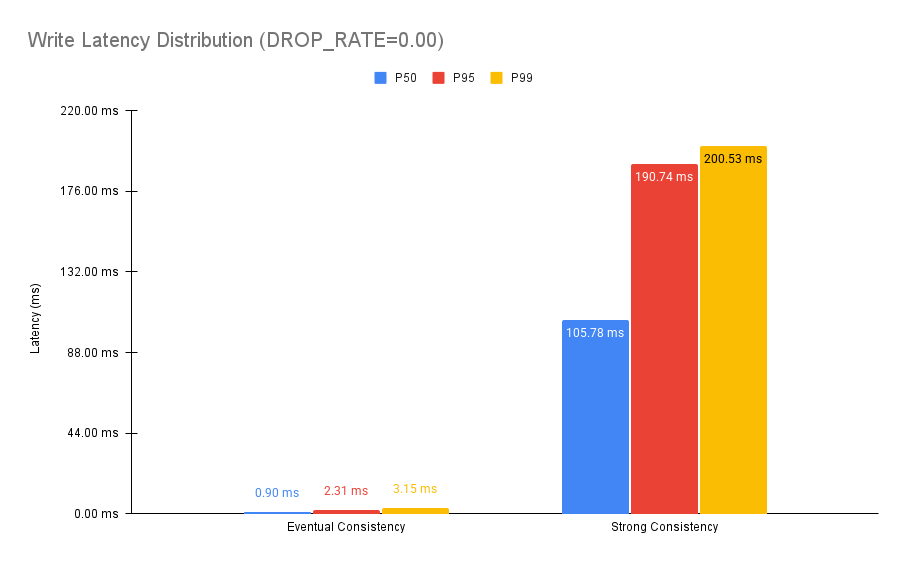
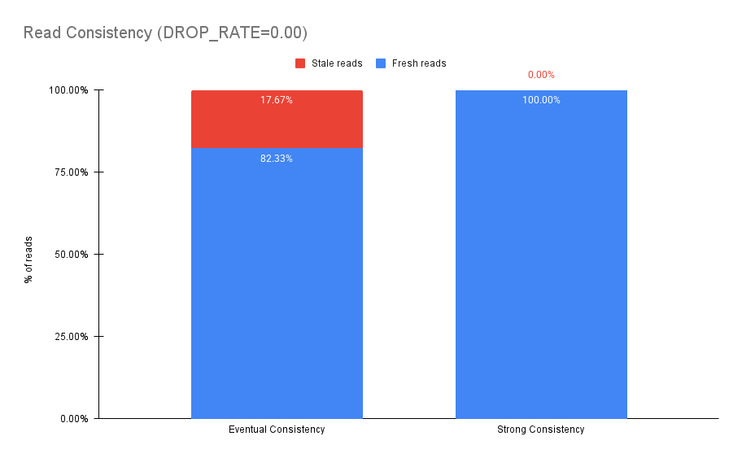
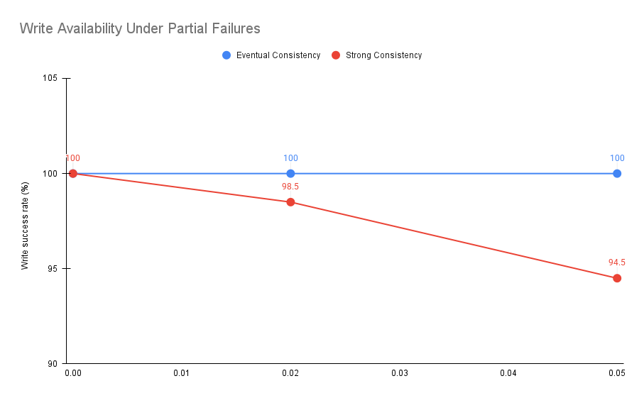
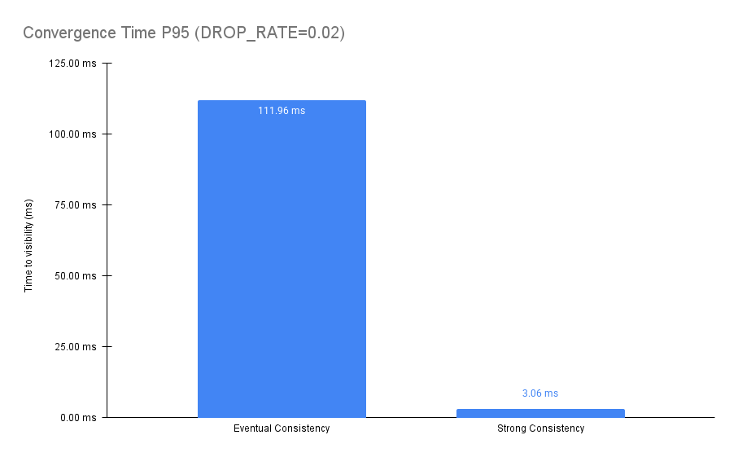

# Consistency Lab — Strong vs Eventual Consistency in Practice

## 🎯 Motivation

Distributed systems force architects to make explicit trade-offs between **consistency**, **availability**, and **latency**.\
While these trade-offs are well described in theory (CAP theorem, PACELC), they often remain abstract until engineers observe their **practical consequences** under real latency distributions, replication delays, and failures.

This repository exists to **make those trade-offs tangible**.

Instead of discussing consistency models purely at a conceptual level, this project provides a **minimal**, **reproducible experiment** that allows you to:

- Observe how **strong consistency** impacts write latency and availability
- Observe how **eventual consistency** improves availability and latency at the cost of stale reads
- Measure **real metrics** (p50, p95, p99, stale read rate, convergence time)
- Understand **why architects choose different models for different domains**

This is not a production-ready database.
It is an **educational laboratory** designed to demonstrate architectural decisions with data.

## What This Project Simulates

The system consists of:

- Two independent nodes (`node_a` and ``node_b`)
- Each node has:
  - An **in-memory data store**
  - An **HTTP API**
  - An **asynchronous replication mechanism**
- Replication is affected by:
  - Random latency (jitter)
  - Optional message drops
  - Network-like delays

Clients interact with the system using two consistency modes:

- **Strong consistency (simulated quorum 2/2)**
- **Eventual consistency (asynchronous replication)**

A load generator produces writes and reads and records observable system behavior.

## 🧠 Consistency Models Explained (Architect-Level)

### 🔒 Strong Consistency (Linearizable Writes — Simulated)

In this project, *strong consistency* is approximated using a **2/2 acknowledgment model**:

1. A write is applied locally
2. The update is sent to the peer node
3. The request **waits for peer acknowledgment**
4. Only then does the API return success

**Implications:**

- A successful write guarantees that **all replicas have applied the update**
- Any subsequent read from any node will observe the write
- Latency includes:
  - Local processing
  - Network delay
  - Remote acknowledgment

**Trade-offs:**

| Benefit                    | Cost                                   |
| -------------------------- | -------------------------------------- |
| No stale reads             | Higher write latency                   |
| Predictable read behavior  | Reduced availability during partitions |
| Strong invariants possible | Slower tail latencies                  |

\
This model is typically chosen when:

- Business invariants must **not be violated**
- Reads must reflect the latest committed state
- Temporary unavailability is preferable to inconsistency

Examples:

- Financial ledgers
- Inventory with strict stock guarantees
- Distributed locks
- Configuration management systems

### 🔁 Eventual Consistency (Asynchronous Replication)

In eventual consistency mode:

1. A write is applied locally
2. The API returns success immediately
3. Replication occurs asynchronously in the background

**Implications:**

- Reads may temporarily return **stale data**
- Different nodes may observe different states
- The system converges *eventually*, assuming no permanent failures

**Trade-offs:**

| Benefit                | Cost                                    |
| ---------------------- | --------------------------------------- |
| Very low write latency | Stale reads                             |
| High availability      | Read-your-writes not guaranteed         |
| Better scalability     | Requires conflict resolution strategies |

\
This model is commonly chosen when:

- Temporary inconsistency is acceptable
- High throughput and availability are priorities
- The domain tolerates approximation

Examples:

- Social media counters (likes, views)
- Logging and analytics pipelines
- Recommendation systems
- Search indexes

## 🏗️ Why This Is Not About Databases — But About Architecture

The same trade-offs appear regardless of technology:

- SQL vs NoSQL
- Leader-based vs leaderless systems
- Synchronous vs asynchronous replication
- Microservices communication patterns
- Cache consistency strategies

This project isolates the **core architectural decision**, independent of vendor or database engine.

## ⚙️ How the Experiment Works

For each iteration, the client performs:

1. `PUT /items/{id}` on a random node
2. Waits a small random delay (0–300ms)
3. `GET /items/{id}` from a random node
4. Measures latency, visibility, staleness, and convergence time

Replication is affected by artificial latency and optional message drops.

## 📊 Metrics Collected

The client reports:

- ⏱️ **Latency**
  - p50 / p95 / p99 for writes
  - p50 / p95 / p99 for reads
- ✅ **Availability**
  - Successful writes / total writes
  - Successful reads / total reads
- 🔄 **Consistency Observability**
  - Stale read rate (read returned an older version than the last written)
  - Read-after-write visibility failures (subset of stale reads)
- ⏳ **Convergence**
  - Time until both replicas observe the same value

These metrics reflect **what a real client experiences**, not internal system guarantees.

> **Note:** Read-after-write violations are inferred from stale reads observed
shortly after a successful write and are not classified as a separate metric.

## 🧪 Experimental Setup

This project compares strong consistency and eventual consistency using a
minimal in-memory replicated datastore implemented in Go.

Each experiment runs with:

- Two nodes (A and B)
- Asynchronous or synchronous replication depending on the consistency mode
- Uniform random read-after-write delay (`readlag = 300ms`)
- Replication delay uniformly distributed between 20ms and 200ms
- Fixed write rate: 80 writes/sec
- Test duration: 15 seconds
- ~1200 write/read iterations per run
- Convergence sampling: ~5% of operations

To simulate partial failures, a configurable replication drop rate (`DROP_RATE`)
was introduced, representing transient network failures or message loss.

### Baseline (DROP_RATE = 0.00)

\


| Metric              | Eventual Consistency | Strong Consistency |
| ------------------- | -------------------- | ------------------ |
| Write latency (p50) | ~0.9 ms              | ~105 ms            |
| Write latency (p95) | ~2.3 ms              | ~191 ms            |
| Read hit rate (200) | 82.3%                | 100%               |
| Stale reads         | 17.7%                | 0%                 |
| Convergence p95     | ~110 ms              | ~2.4 ms            |

#### Read Consistency (Fresh vs Stale)



#### Interpretation

Without failures, the difference between the two models is dominated by
coordination cost.

Strong consistency guarantees read-after-write correctness, but every write
must wait for replication acknowledgment, resulting in significantly higher
write latency.

Eventual consistency confirms writes locally, achieving much lower write
latency, but allows a temporary window where reads may return stale data.

### ⚠️ Moderate Failure Scenario (DROP_RATE = 0.02)

| Metric              | Eventual Consistency | Strong Consistency |
| ------------------- | -------------------- | ------------------ |
| Write success rate  | 100%                 | 98.5%              |
| Read hit rate (200) | 81.6%                | 100%               |
| Stale reads         | 18.4%                | 0%                 |
| Convergence p95     | ~112 ms              | ~3.1 ms            |

#### Interpretation

Under partial failures, the trade-off becomes explicit.

Strong consistency preserves correctness by rejecting writes when replication
fails, directly impacting availability.

Eventual consistency preserves availability by accepting all writes, at the
cost of temporary inconsistency. Most data converges quickly, but some reads
observe stale state within the replication window.

### 🔥 High Failure Scenario (DROP_RATE = 0.05)

| Metric              | Eventual Consistency | Strong Consistency |
| ------------------- | -------------------- | ------------------ |
| Write success rate  | 100%                 | 94.5%              |
| Read hit rate (200) | 79.0%                | 100%               |
| Stale reads         | 21.0%                | 0%                 |
| Convergence p95     | ~106 ms              | ~2.5 ms            |

#### Interpretation

As replication failures increase, strong consistency increasingly sacrifices
availability to maintain correctness.

Eventual consistency continues to accept writes and remain available, but the
probability of reading stale data grows.

This behavior reflects real-world distributed systems where availability and
consistency cannot be maximized simultaneously under partial failures.

#### Write Availability Under Partial Failures



#### Convergence Time (p95)



## 🧠 Key Takeaways

- **Consistency is a business decision**, not a technical default
- Strong consistency trades **latency and availability** for correctness
- Eventual consistency trades **immediate correctness** for scalability and performance
- Tail latency (p95/p99) often matters more than averages
- Many real-world systems use **hybrid approaches**, mixing both models

## 🚫 What This Experiment Does NOT Prove

- It does not model quorum-based systems (e.g. Dynamo-style N/W/R).
- It does not include leader election or consensus protocols.
- It does not simulate large clusters or cross-region replication.
- It focuses on read-after-write behavior, not long-term divergence.

## 📂 Results & Reproducibility

All raw benchmark outputs, summarized datasets, and generated charts
used in this README are available in the [`results/`](results/) directory.

This includes:

- 📄 Raw terminal outputs for each scenario
- 🖼️ Exported charts used in this document

All results can be reproduced locally by following the instructions below.

## 📚 Learning & Self-Assessment

This repository can also be used as a learning and interview-preparation resource.

- Conceptual summary of consistency trade-offs
- Self-assessment questions
- Reference answers for validation

See the [`learning/`](./learning) folder for details.

## ▶️ How to Run the Project

### Requirements

- Go 1.25.1+
- Docker (optional, recommended)

### Option 1 — Using Make (Recommended)

1. Start both nodes:

```bash
make up
```

2. Run the eventual consistency benchmark:

```bash
make client-eventual
```

3. Run the strong consistency benchmark:

```bash
make client-strong
```

4. Stop everything:

```bash
make down
```

### Option 2 — Without Make

1. Start Node A

```bash
NODE_NAME=node_a ADDR=:8081 PEER_URL=http://localhost:8082 go run ./cmd/node
```

2. Start Node B (in another terminal)

```bash
NODE_NAME=node_b ADDR=:8082 PEER_URL=http://localhost:8081 go run ./cmd/node
```

3. Run the client

Eventual consistency:

```bash
go run ./cmd/client -a http://localhost:8081 -b http://localhost:8082 -mode eventual -rps 80 -dur 15s
```

Strong consistency:

```bash
go run ./cmd/client -a http://localhost:8081 -b http://localhost:8082 -mode strong -rps 80 -dur 15s
```

## 📚 References & Deep Dive

- [**CAP Theorem — Eric Brewer**](https://www.infoq.com/articles/cap-twelve-years-later/)
- [**Designing Data-Intensive Applications — Martin Kleppmann**](https://dataintensive.net/)
- [**Jepsen Consistency Analysis**](https://jepsen.io/consistency)
- [**Amazon Dynamo Paper**](https://www.allthingsdistributed.com/files/amazon-dynamo-sosp2007.pdf)
- [**Google Spanner (TrueTime & Strong Consistency at Scale)**](https://research.google/pubs/pub39966/)
- [**PACELC Theorem**](https://en.wikipedia.org/wiki/PACELC_theorem)

## Final Note

If consistency decisions feel abstract, this project exists to prove one thing:

> **You don’t choose consistency models.** \
> **Your domain constraints choose them for you.**

---

📌 **Tip:**  
Most architectural trade-offs only become obvious when observed under
real latency distributions and partial failures.
This project exists to make those trade-offs visible.